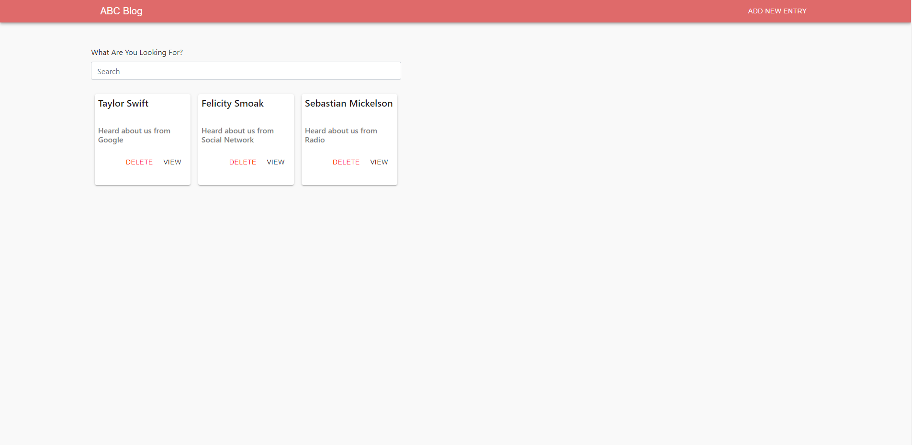

## What Did I use?

* I used react-create-app to create a react project.
* I also used json-server so that I can "mock" APIs to make my code upon.
* I also Used class based components.   
  

* In the previous modal a user can enter their information and it will be created and seen on the homepage.

  

* As you can see the entry is added to the homepage.
* Also, there's the DELETE option where a person can delete the entry and a VIEW option where a person can view the entry.

* There's a search bar.  

  
 
* The view would show as the previous illustration.

